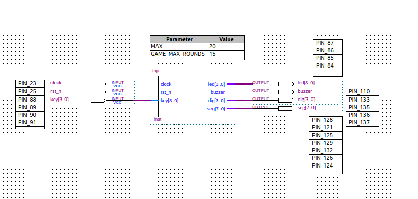
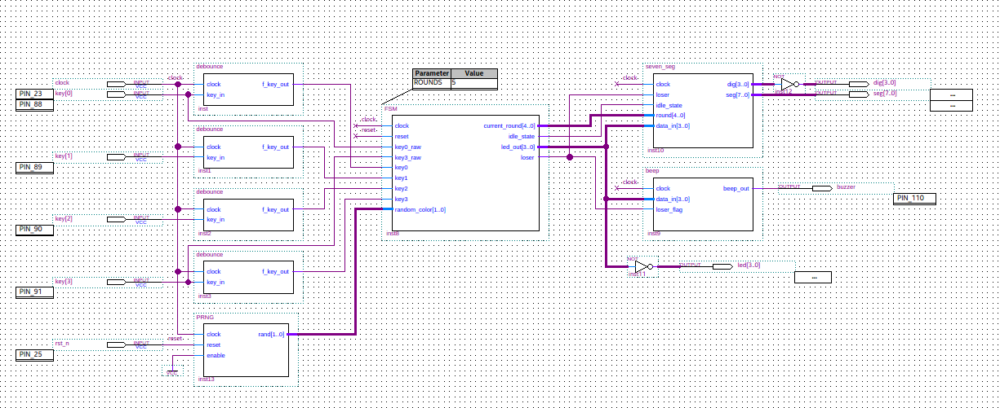

# Project Overview

```bash
project/
├── src/           # .tdf (AHDL source) and .bdf (block diagrams) files
│   ├── top.tdf    # Top-level Entity
│   └── modules/   # Reusable modules
├── test/          # Unity tests
├── sim/           # Testbenches and simulation vectors (.vwf, .tbl)
├── constraints/   # Pinout files (.qsf, .acf)
├── docs/          # Schematics, specifications
└── README.md
```

- Can use the ```src/top.tdf``` (AHDL file) or ```tests/top_test.bdf``` (Block Diagram file) to flash the firmware.

### Top Block Diagram
[](docs/top_test.png)

### Top RTL connection using Blocks Diagrams
[](docs/subtop_test.png)
